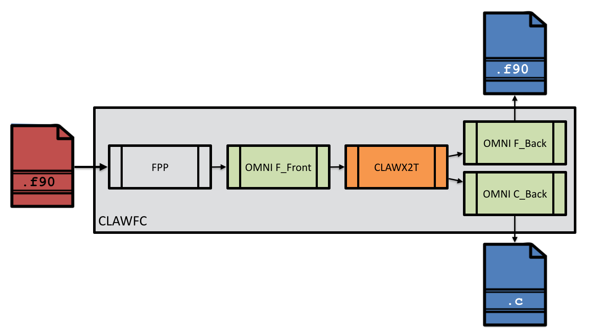

# CLAW Fortran Compiler (omni-cx2x)

### language specification
The directives that control the transformation flow are defined in the
CLAW language definition.

[CLAW language definition](https://github.com/C2SM-RCM/claw-language-definition)

### Status of implementation
We are currently implementing the version `v0.1` of the CLAW language
specification into our own translator.

[CLAW language specification v0.1](https://github.com/C2SM-RCM/claw-language-specification/tree/v0.1)

The current development status is the following (Only limited cases have been
tested).
- [x] loop-fusion
- [x] loop-interchange
- [x] loop-extract
- [x] remove

### Versioning convention
The versioning convention for the CLAW Compiler follows the versioning of the
language definition. Version `0.1.0` implements the language specification
`v0.1`. If there is bug fix or enhancement happening in the version implementing
`v0.1` of the language specification, the last digit is incremented (e.g.
`0.1.1`) and so on.

### Compiler workflow
The diagram below shows the workflow of the CLAW Compiler.

##### Key components:
* **FPP**: standard preprocessor.
* **F_Front**: Fortran front-end. Convert Fortran program into an intermediate
representation.
* **cx2x**: CLAW intermediate representation translator.
* **om-f-back**: Fortran back-end. Generates Fortran code from intermediate
representation.

### How to install
See [INSTALL.md](https://github.com/clementval/claw-compiler/blob/master/INSTALL.md) file.

### OMNI Compiler
The CLAW Compiler is built on the top of the OMNI Compiler. For more
information: [OMNI Compiler website](http://omni-compiler.org)
